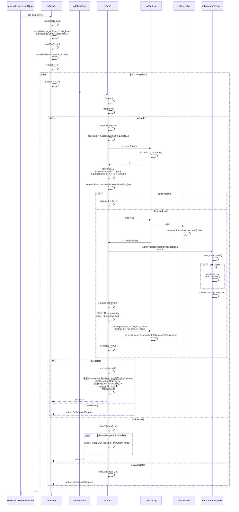
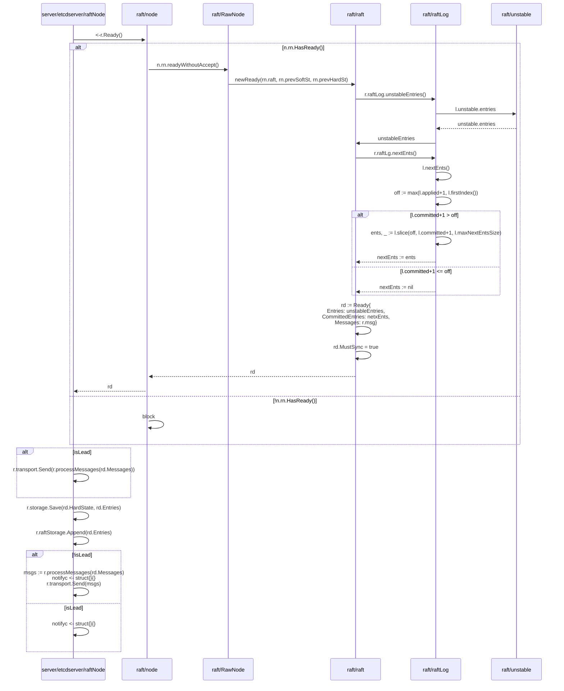
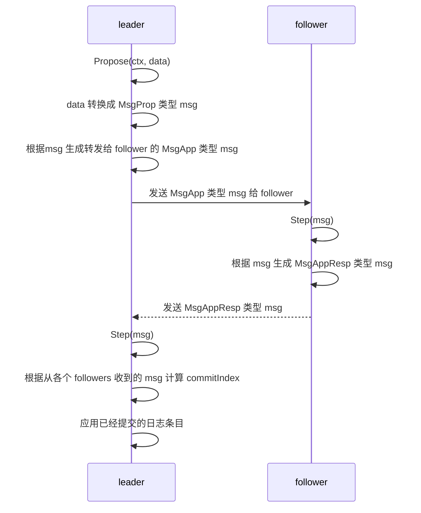

# 计划

* [X] 过一遍 etcd/raft 组件, 理解各个组件的大致作用
* [X] 从日志复制这条逻辑线查看 etcd/raft 中的代码逻辑
  * [X] 理清 Propose 处理逻辑
  * [X] 理清 Ready 处理逻辑
  * [ ] 理清 msg 在各个 raft 节点间的流转逻辑
* [ ] 理清 etcd/raft 日志复制宏观流程与细节

# 主要组件

| 名称                                    | 作用 |
| --------------------------------------- | ---- |
| raft/node.go.Node                       |      |
| raft/node.go.node                       |      |
| raft/rawnode.go.RawNode                 |      |
| raft/raft.go.raft                       |      |
| raft/tracker/tracker.go.ProgressTracker |      |
| raft/unstable.go.unstable               |      |

# Propose 流程

## 疑问

### 关于 leader 对自身 nextIndex 与 matchIndex 的更新

 leader 在没有将 entries 追加到持久层的时候就更新了自己的 nextIndex 和 matchIndex
如果应用后面没有成功持久化 entries 怎么办?

~~### 关于 propose 与 apply 和 用户查询修改状态的异步问题~~

现在发现在 Propose的时候 raft/raft.appendEntry 中执行 maybeCommit() 计算保存 commitIndex,

并不是 append entries --> replicate to followers --> commit entries --> apply entries 这样一个顺序执行的流程

而是一个异步的流程, 这样怎么保证用户 propose 后, 再查询会得到最新的结果?

#### 答案

server/etcdserver/Etcdserver 通过 wait/Wait.register 和 trigger 完成变异步为同步

# Ready() 处理流程

## 疑问

### follower 在接收到消息后做了什么? 什么时候 leader 会更新所有 follower 节点的 nextIndex 和 matchIndex 更新, 并计算 commitIndex ?

# 日志复制在 leader 与 followers 中的处理流程
宏观流程

